# Data Visualization Project

## Data

The data I propose to visualize for my project is [Climate change and Agriculture Dataset from Kaggle](https://www.kaggle.com/datasets/waqi786/climate-change-impact-on-agriculture).

## Questions & Tasks

The following tasks and questions will drive the visualization and interaction decisions for this project:
- Analyze Climate Trends Over Time
- Explore how variations in climate variables affect agricultural productivity
- Compare Agricultural Productivity Across Regions
- Investigate how specific climate factors (temperature vs. rainfall, ...) impact different crop types
- Discover how crop diversity in a region affects resilience to climate changes

## Sketches

<kbd>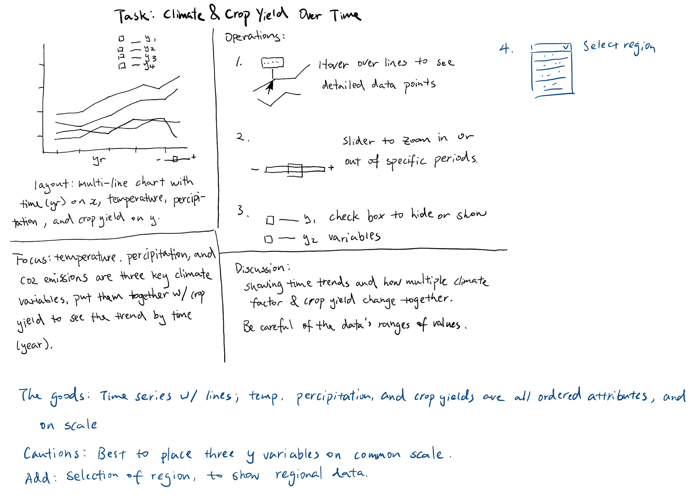</kbd>
<kbd>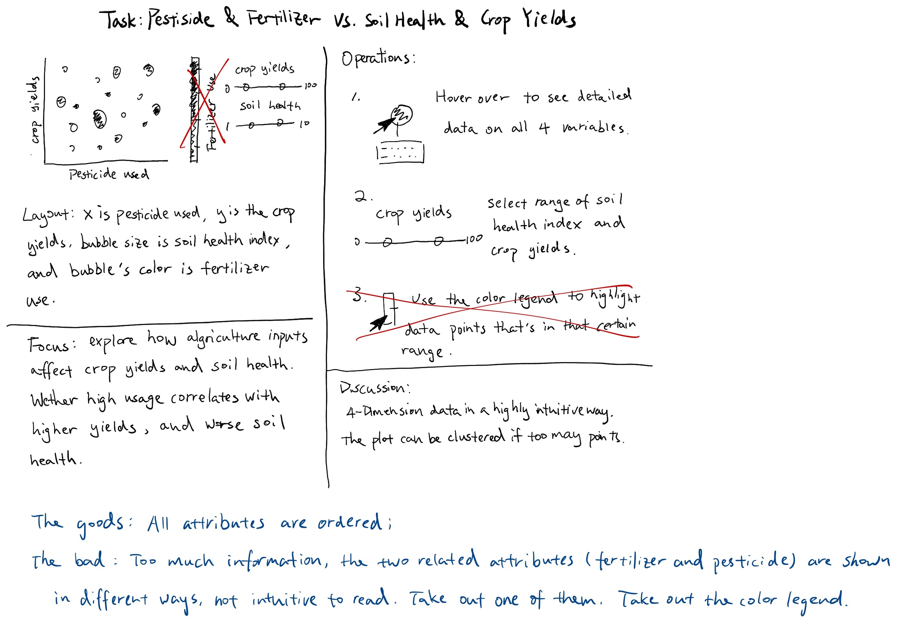</kbd>
<kbd>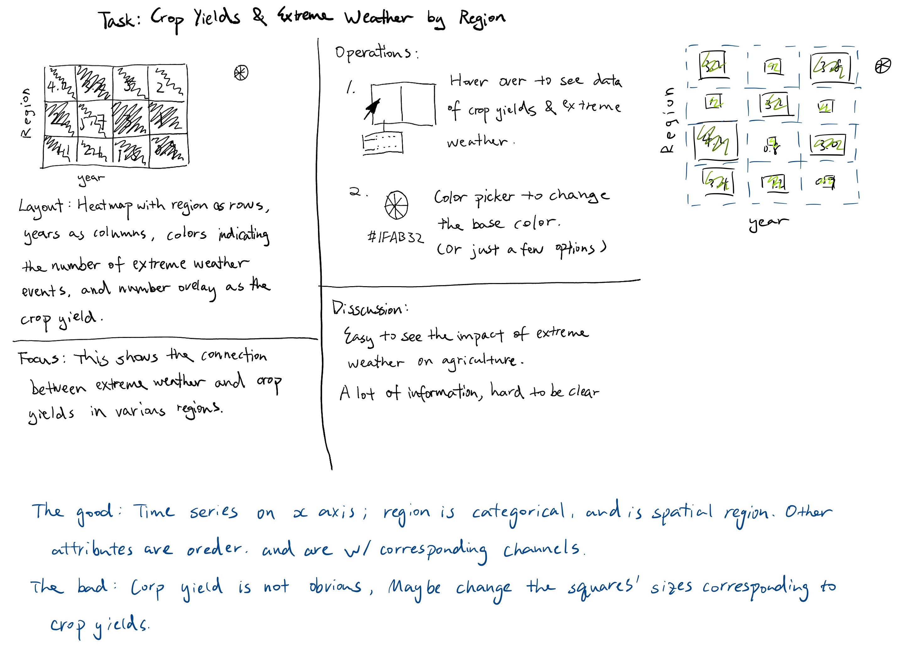</kbd>

##### 1. Climate & Crop Yield Over Time
- Task: Analyze Climate Trends Over Time
- This visualization focuses on long-term trends in climate factors like temperature and precipitation, along with crop yields, allowing users to examine changes and correlations over the years.
##### 2. Pesticide & Fertilizer vs. Soil Health & Crop Yields
 - Task: Explore how variations in climate variables affect agricultural productivity
 - By visualizing pesticide use, fertilizer application, soil health, and crop yields, this chart helps users investigate how these factors impact agricultural productivity, highlighting potential effects on soil quality and yield outcomes.
##### 3. Crop Yields & Extreme Weather by Region
 - Task: Compare Agricultural Productivity Across Regions
 - This heatmap shows crop yields and extreme weather events by region over time, allowing users to compare productivity across different areas and understand how regional variations in extreme weather affect yields.

## Prototypes

(images are clickable which will open the link to the project.)

This is a prototype of visualization of the first sketch. It's a multi-line chart and it shows trends in crop yield, temperature, and precipitation over time from the year 2000 to 2005. Each line represents a different variable, allowing for an analysis of how these factors change over time and potentially relate to one another.

<a href="https://vizhub.com/wyy-47/pseudovizforclimatedata" target="-black">
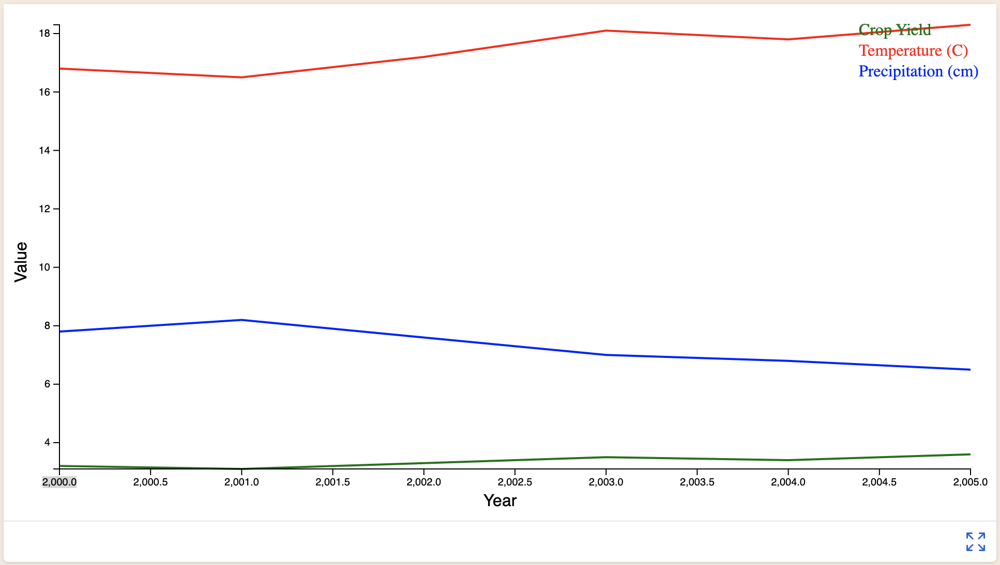
</a>

This is a prototype of the second sketch.

<a href="https://vizhub.com/wyy-47/scatter-plot-for-climate-data" target="-black">
<kbd>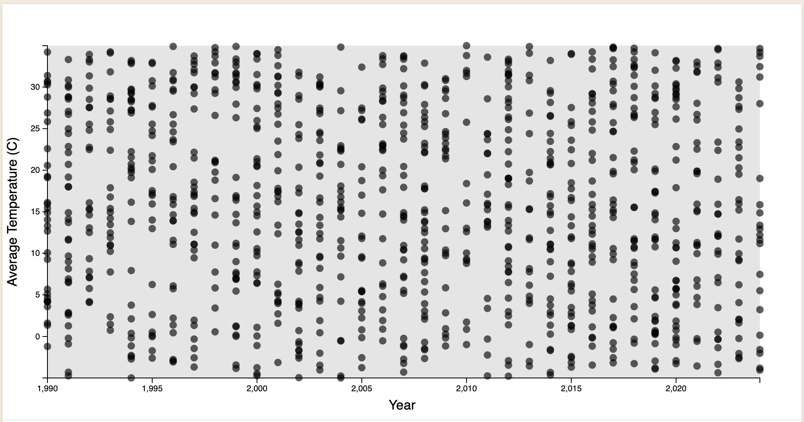</kbd>
</a>

This is a start for the third sketch, but with a globe prioritizing the location (region) rather than a heat map.

<a href="https://vizhub.com/wyy-47/climate-world-map-cities" target="-black">
<kbd>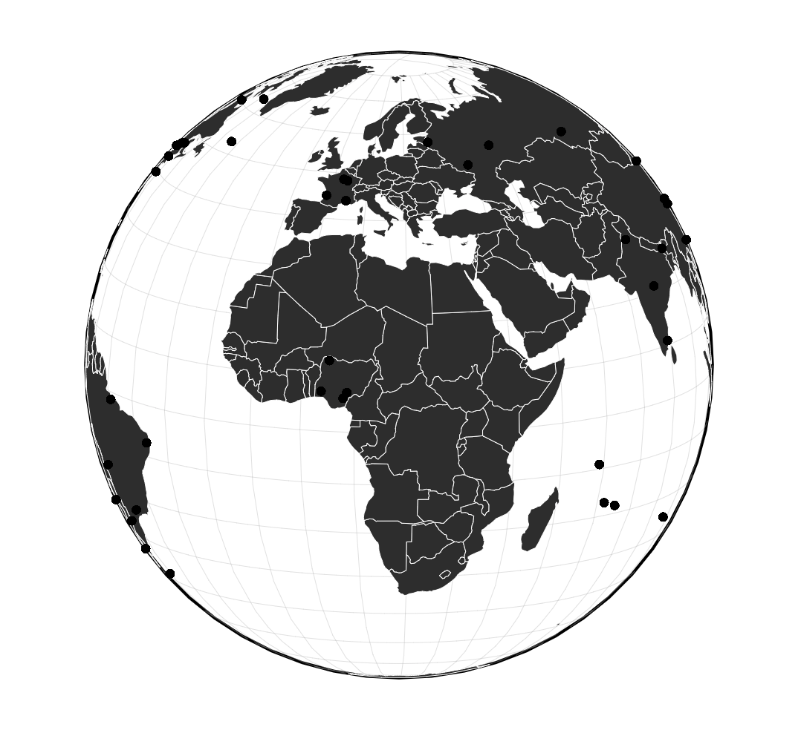</kbd>
</a>

## Open Questions
- Combining climate and crop data with different units and scales may require complex normalization for meaningful comparisons.
- Implementing dynamic filters and region selectors could be technically challenging, potentially affecting performance with larger datasets.

## Milestones  and Progress

### Week 1:
Collect, clean, and normalize all required datasets, including climate, crop yield, and regional shapes.
### Week 1 Progress:
Created a panning and zooming globe with cities that agriculturally represents
the country-region pair of each entries. Further work will be done to incorporate crop yields by crop type. 
Each country-region might have multiple crops, and maybe offset the circles to show everything or have a select
bar or such.
<a href="https://vizhub.com/wyy-47/climate-world-map-cities" target="-black">
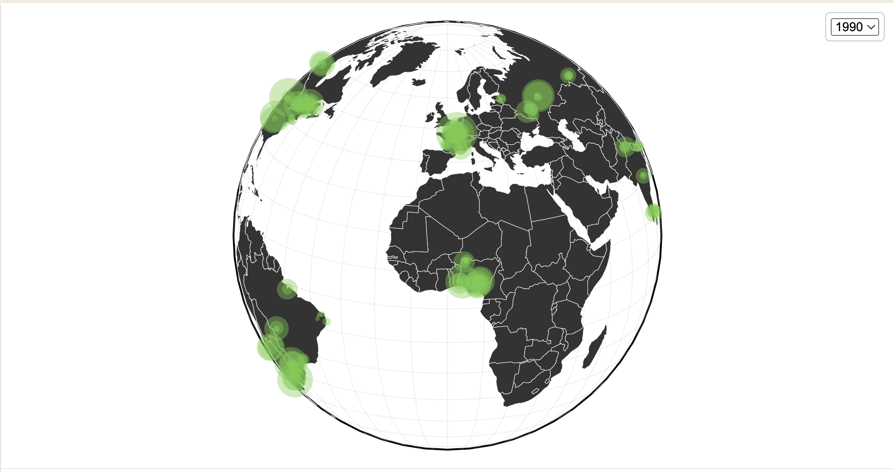
</a>

### Week 2: 
Build basic versions of each chart without interactivity, ensuring data alignment and accuracy.

### Week 2 Progress:
Continued to work on the same chart. updates:
- Tooltip with info
- Dropdown bar with year selection
- Give each distinct crop type a color and size them according to the value
- Different crop yields are spiraled out from the city's lat and long
<a href="https://vizhub.com/wyy-47/climatecitites-fixingtooltip" target="-black">
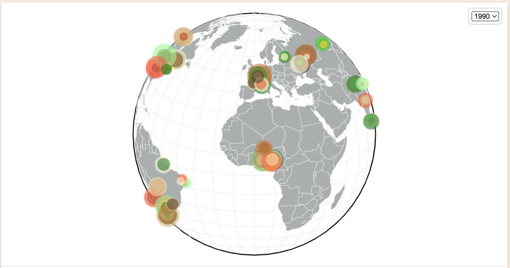
</a>

### Week 3:
Add filters, region selection, and hover details to enhance exploration and usability.

### Week 3 Actual:
- Added color legend for crop types
- Color legend can be selected to show the selected crop type
- Can also be unselected to show all crop type
<a href="https://vizhub.com/wyy-47/climate-cities-color-legend" target="-black">
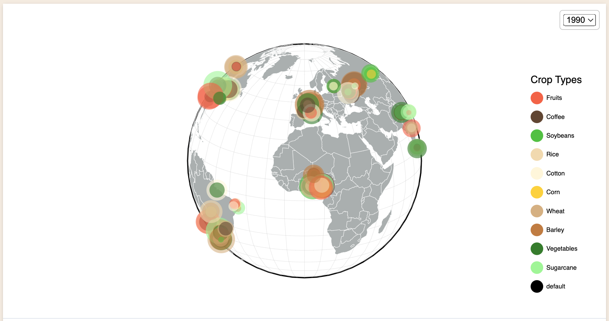
</a>

### Week 4:
Refine visualizations, conduct user testing, and finalize adjustments for a polished, user-ready system.

### Week 4 Progress:
- Fixed tooltips not disappearing when zooming and dragging.
- Fixed tooltips showing up when a selection is made.
- Fixed circles overlapping in the same region in the same year.
<a href="https://vizhub.com/wyy-47/climatecitites-fixed" target="-black">
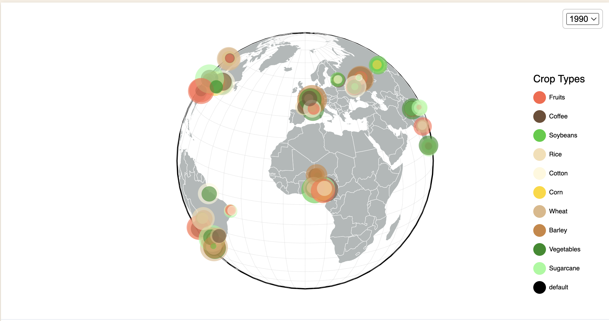
</a>

### Week 5 Progress:
- Started to work on another viz, the second sketch. 
- Implemented the data into scatter plot, where x and y axis is the pesticide usage and fertilizer usage; the size of the circle is the crop yield; the color is the health index. 
- Tooltips for detailed information when hovered over the circles.
<a href="https://vizhub.com/wyy-47/climate-scatter-plot-v1" target="-black">
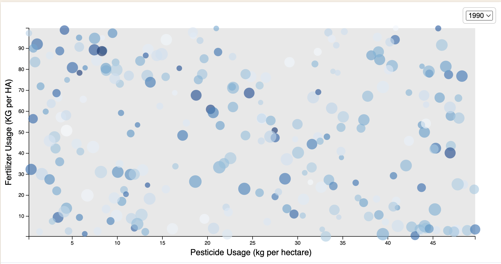
</a>

### Week 6 Progress:
- Implemented another filter for the scatter plot to select region
- Can also select "all region" to show all data in a certain year
<a href="https://vizhub.com/wyy-47/climate-scatter-v3" target="-black">
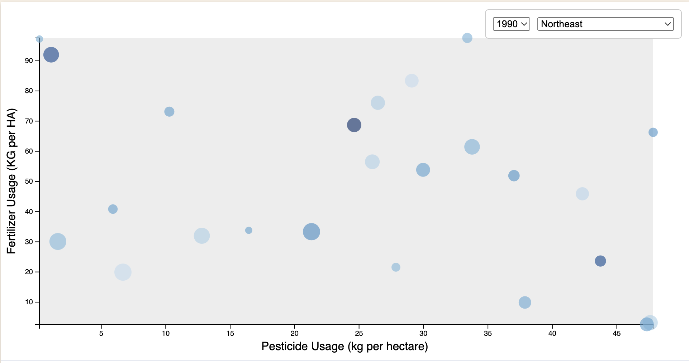
</a>

## TODO
- maybe combine/average same crop type in the same year in the same region for the globe viz
